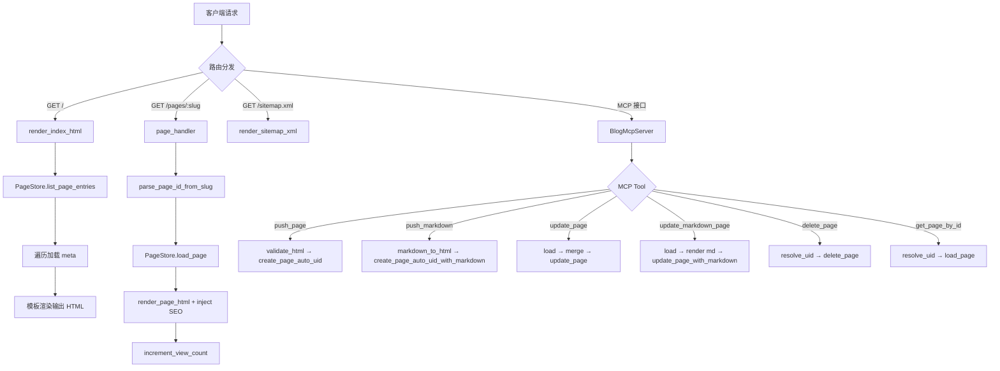
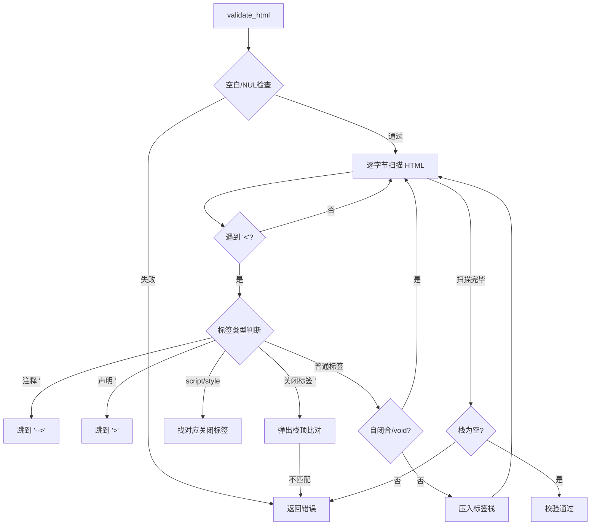

# SolinBlog 功能树

## 1. 功能目录

```
SolinBlog
├── Web 服务层 (main.rs)
│   ├── HTTP 路由
│   │   ├── GET / — 首页（文章列表）
│   │   ├── GET /pages/{slug} — 文章页面
│   │   ├── GET /sitemap.xml — Sitemap
│   │   ├── GET /tools/token-generator — Token 生成器页面
│   │   └── GET /public/{*path} — 静态资源
│   └── MCP 接口（StreamableHTTP）
│       ├── push_page — 创建 HTML 页面
│       ├── push_markdown — 创建 Markdown 页面
│       ├── get_all_page — 列出所有页面元数据
│       ├── get_page_by_id — 按 ID 获取页面（含 HTML）
│       ├── delete_page — 删除页面
│       ├── update_page — 更新 HTML 页面
│       ├── update_markdown_page — 更新 Markdown 页面
│       ├── search_images — SearXNG 图片搜索
│       ├── get_blog_style — 获取博文风格指南
│       └── get_html_style — 获取 HTML 风格参考
├── 数据存储层 (store.rs)
│   ├── PageStore — 文件系统页面存储
│   │   ├── create_page / create_page_auto_uid — 创建页面
│   │   ├── load_page / load_page_markdown — 加载页面
│   │   ├── update_page / update_page_with_markdown — 更新页面
│   │   ├── update_page_meta / update_page_html — 分别更新
│   │   ├── delete_page — 删除页面
│   │   ├── increment_view_count — 浏览计数
│   │   ├── rebuild_index — 重建索引
│   │   └── resolve_page_id_by_uid — UID 解析
│   ├── validate_html — HTML 标签平衡校验
│   └── atomic_write — 原子文件写入
├── 渲染层 (web.rs)
│   ├── render_index_html — 首页渲染
│   ├── render_page_html — 文章页渲染（注入 SEO meta）
│   ├── render_markdown_page — Markdown 渲染为完整 HTML
│   ├── render_404_html — 404 页面渲染
│   ├── render_sitemap_xml — Sitemap 生成
│   └── inject_seo_meta — SEO 元标签注入
├── 图片搜索 (image.rs)
│   └── search_images — SearXNG 并发关键词图搜
├── 构建脚本 (build.rs)
│   └── 特殊图片格式自动转 PNG
└── 自检工具 (bin/store_selfcheck.rs)
    └── Store CRUD 完整性自检
```

## 2. 核心功能实现流程图



## 3. 核心功能实现文字说明

### 3.1 MCP 接口层 (`main.rs`)
- **入口函数**: `main()` 启动 Axum HTTP 服务器 + MCP StreamableHTTP 服务
- **MCP 认证**: 通过 URL 路径中的 token（`/{token}/mcp`）实现简单认证
- **工具路由**: 使用 `rmcp` 的 `#[tool_router]` 宏自动注册工具方法
- **错误处理**: 所有 MCP 工具方法返回 `Result<Json<...>, String>`，业务错误通过 JSON 中的 `success: false` + `error` 字段表达，不会导致服务崩溃

### 3.2 数据存储层 (`store.rs`)
- **存储结构**: 每个页面一个目录（`data/{page_id}/`），包含 `meta.json` + `index.html` + 可选 `content.md`
- **全局索引**: `data/index.json` 维护所有页面的 SEO 元数据索引
- **原子写入**: 通过写临时文件 + `rename` 实现原子性，避免数据损坏
- **UID 生成**: 使用 `getrandom` 生成 16 位字母数字随机 ID
- **SEO Slug**: 中文标题通过 `pinyin` 库转拼音生成 URL 友好的 slug

### 3.3 渲染层 (`web.rs`)
- **模板系统**: 简单的 `{{placeholder}}` 替换
- **SEO 注入**: `inject_seo_meta` 解析 HTML `<head>` 区域，移除旧的 title/description/keywords 后注入新的
- **Markdown 支持**: 使用 `pulldown-cmark` 将 Markdown 转为 HTML

### 3.4 图片搜索 (`image.rs`)
- **并发搜索**: 使用 `tokio::task::JoinSet` 对多个关键词并发请求 SearXNG
- **配置**: 通过 `SEARXNG_URL` 环境变量指定 SearXNG 实例地址

## 4. 子功能实现流程图

### 4.1 HTML 校验流程



## 5. 子功能实现文字说明

### 5.1 SEO 元标签注入 (`inject_seo_meta`)
- **入口**: `web.rs::inject_seo_meta(html, title, seo)`
- **逻辑**: 在 HTML 中查找 `<head>` 区域 → 调用 `remove_head_seo_tags` 移除旧的 `<title>` 和 `<meta name="description/keywords">` → 在 `<head>` 开头插入新的 SEO 标签
- **兜底**: 无 `<head>` 时在 `<html>` 后插入，无 `<html>` 时在 `<body>` 前插入，都没有则直接前置

### 5.2 原子文件写入 (`atomic_write`)
- **入口**: `store.rs::atomic_write(path, data)`
- **逻辑**: 写入 `.tmp` 临时文件 → `fs::rename` 原子替换目标文件（Unix 上 rename 是原子操作）

### 5.3 MCP Token 认证
- **入口**: `main.rs::main()` 中的 `mcp_path`
- **逻辑**: 从 `MCP_TOKEN` 环境变量读取，若为空则使用 `getrandom` 随机生成 16 位 token，将 MCP 服务挂载到 `/{token}/mcp` 路径

## 6. 数据结构

### PageMeta（页面元数据）
```
PageMeta {
    seo: SeoMeta {
        title: String,         // 显示标题
        seo_title: String,     // SEO 标题 (slug)
        description: String,   // 页面描述
        keywords: Option<Vec<String>>,
        extra: Map<String, Value>,
    },
    page_uid: String,          // 16位随机唯一 ID
    created_at: i64,           // 创建时间戳
    updated_at: i64,           // 更新时间戳
    view_count: u64,           // 浏览次数
    extra: Map<String, Value>,
}
```

### StoreIndex（全局索引）
```
StoreIndex {
    pages: BTreeMap<String, PageIndexEntry {
        page_id: String,
        seo: SeoMeta,
        page_uid: String,
        original_id: Option<String>,
    }>
}
```

### 文件系统布局
```
data/
├── index.json                 # 全局索引
├── {page_id}/
│   ├── meta.json              # 页面元数据
│   ├── index.html             # 页面 HTML
│   └── content.md             # (可选) Markdown 源文件
```
